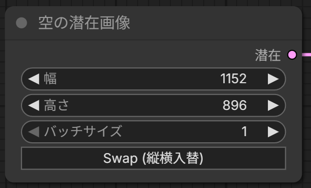

# ComfyUI-ModelDumpster

> [!NOTE]
> **本リポジトリは実験的なノードの集まりです。** あまり実用的ではないかもしれません。
> このリポジトリを利用して、自由にどんどん実験・検証を行ってください！
> 
> *This repository is a collection of experimental nodes and might not be highly practical. Please feel free to use it for your own experiments and research!*

**SDXLモデルの解析ノード寄せ集め。** 「2つのモデルはどこが違うか」「この絵はモデルのどこが作ってるか」を
ヒートマップで見る道具。マージ本体の [ComfyUI-RecipeMerge](https://github.com/galigali-san/ComfyUI-RecipeMerge) と地続きで、
差分から自動でマージレシピを吐ける。

> **English**: Model-analysis nodes for ComfyUI (SDXL): a block×element **diff heatmap** between two models,
> an **auto-merge recipe** generator from that diff, and a **block ablation analyzer** that measures which blocks
> actually drive a given image (revert each block toward a reference model and observe the output change).
> Pairs with ComfyUI-RecipeMerge for diff-driven merging.

## インストール

```
cd ComfyUI/custom_nodes
git clone https://github.com/galigali-san/ComfyUI-ModelDumpster
```

再起動するだけ。追加依存なし。ノードは `advanced/model_analysis` カテゴリに3つ、`latent` カテゴリに1つ追加されます。

| ノード | 何をするか |
|---|---|
| **Model Diff Viewer (Heatmap)** | 2モデルが**ブロック×要素(タブでサブ要素まで)どれだけ違うか**をヒートマップ表示 |
| **Diff → Recipe (auto-merge)** | 上の差分から「違う所だけ混ぜる」自動マージレシピを生成 |
| **Model Ablation Analyzer (Heatmap)** | **この絵のどこにどのブロックが効いてるか**を実測(ブロックを参照モデルに戻して出力変化=重要度) |
| **Empty Latent Image (Swap)** | ワンクリックで幅と高さを入れ替えられる機能付きの空の潜在画像生成ノード |
| **Calculator (電卓)** | キャンバス上で完結する四則計算(+−×÷)の電卓。ボタンを押すだけで計算でき、結果を出力にも出せる |
| **Session Stats (セッション統計)** | 起動中に実行された生成枚数、平均生成時間、使用されたモデルの集計グラフをリアルタイム表示する常駐型ダッシュボード |

※ 解析系ノードはすべて**SDXL専用**(ヒートマップは IN00〜08 / M00 / OUT00〜08 レイアウト)です。

## Model Diff Viewer (Heatmap)

2モデル(`model1` / `model2`)のUNetをキー単位で比較し、違いの大きさをヒートマップ化。

- **タブ**: `ALL` = 6要素(attn1/attn2/ff/norm/proj/other)/ `attn2` 等 = サブ要素(to_q/to_k/…)まで
- **metric**: `relative_l2`(‖A−B‖/max‖‖、既定)/ `cosine`(1−コサイン類似度)
- **色**: 暗い=似ている / 赤い=大きく違う。**PNG保存**ボタンあり
- **出力**: `report` と `heatmap_json`(**Diff → Recipe に繋ぐ**)

## Diff → Recipe (auto-merge)

Diff Viewer の `heatmap_json` から、差分の大きい所だけを混ぜる自動マージレシピを作る。

- `threshold`(この差分以上だけ対象)/ `ratio`(寄せる比率)/ `scale_by_diff`(違う所ほど強く)
- 出力 `recipe` を **RecipeMerge の Elemental Merge (Recipe) の recipe入力**に繋げばそのままマージ

**差分ドリブンのマージ一直線**:
`Model Diff Viewer → Diff → Recipe → (RecipeMerge) Elemental Merge (Recipe) → CheckpointSave`

## Model Ablation Analyzer (Heatmap)

「この絵のどこにどのブロックが効いているか」を実測する(感度解析)。

1. 固定シードのノイズで1回サンプリング(基準)
2. ブロック(または要素)を1つずつ **参照モデル(`model_ref`)に戻して** 同じノイズで再サンプリング
3. 出力の変化量 = そのブロックの**重要度**。最大=1.0で正規化してヒートマップに

- 入力: `model` / `model_ref`(素のSDXLベース等)/ `positive`・`negative`・`latent`(解析したい画像をVAEEncode、または空Latent)
- `granularity`: `element`(細かい)/ `block`(速い)、`steps`: **1が最速**、`revert_strength`: 戻す量
- 出力: `report` / `heatmap_json` / `baseline_latent`(VAEDecodeで「何を解析したか」確認)
- **DAAM(単語→画像の空間的作用)とは別軸**。あちらは空間、これは構造(どのブロックか)
- 同梱の [example_workflows/Model_Ablation_example.json](example_workflows/Model_Ablation_example.json) がすぐ使える雛形

> ⚠️ 測定回数ぶんサンプリングするので**GPU推奨**。まず `granularity=block` / `steps=1` で軽く。

## Empty Latent Image (Swap)

標準の「空の潜在画像」(Empty Latent Image) ノードをベースに、ワンクリックで縦横（幅と高さ）のサイズを簡単に入れ替えることができる「Swap (縦横入替)」ボタンを追加したノードです。

ノードは `latent` カテゴリに追加されます。



- **Swap (縦横入替) ボタン**：クリックすると、幅（width）と高さ（height）の数値を即座に入れ替えます。縦長・横長の解像度を頻繁に切り替えて検証する際に便利です。
- 標準ノードの機能を Python の「継承」で引き継いでいるため、生成ロジック自体は完全にオリジナルと同一で安全です。

## Calculator (電卓)

キャンバス上で完結する四則計算(+ − × ÷)の電卓。**Queueも配線も不要**、ボタンを押すだけで計算できる。

- 表示 + ボタン(C / ⌫ / 数字 / 演算子 / . / =)。**演算子の優先順位あり**(`2 + 3 × 4 = 14`)、0除算は `Error`
- 計算はすべてブラウザ側(JS)で完結。`=` 直後に数字を押すと新しい計算、演算子を押すと結果から続けて計算
- グラフに繋ぎたい場合は `result`(FLOAT)/ `display`(STRING)の出力を使える(最後に計算した値)
- `utils` カテゴリ

## Session Stats (セッション統計)

ComfyUIのキャンバス上に常駐し、現在のブラウザセッション中に行われた生成枚数、平均時間、および使用されたチェックポイントモデルの統計データをリアルタイムに記録・視覚化します。

- **📊 統計ボタン**: 画面左下隅に浮かぶ紫・青グラデーションのボタン。クリックするとダッシュボードパネルが展開します。
- **3つの指標**: 「生成枚数」「平均生成時間」「累積生成時間」を自動でリアルタイム計測。
- **使用モデル割合**: 実行中のワークフロー内でロードされているチェックポイント名（`CheckpointLoaderSimple`等から自動抽出）を集計し、横棒のバーグラフで割合を表示します。
- **永続化とリセット**: ブラウザのリロード時にも `localStorage` を通じて統計が保持され、「統計リセット」ボタンでクリアできます。
- フロントエンドのみで動作し、カスタムノードとしてキャンバス上に余計なノードを配置しません。

## クレジット / ライセンス

MIT License © 2026 galigali。マージ本体は [ComfyUI-RecipeMerge](https://github.com/galigali-san/ComfyUI-RecipeMerge)。
